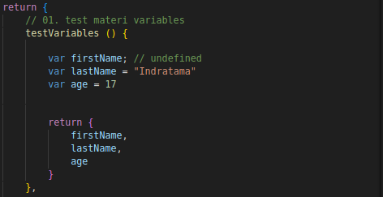
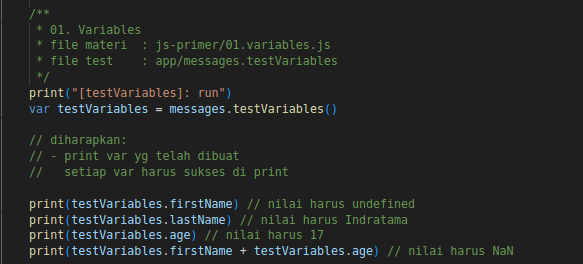
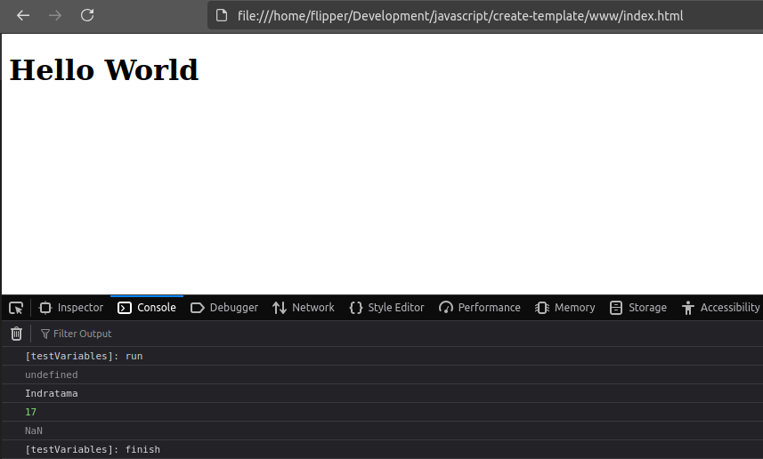

# Chūnin JS - Salamander

## Silabus JavaScript Fundamentals

1. JS Primer
    - overview
        - String | 2min
        - Constants | 2min
        - Undefined values | 2min
        - Booleans | 2-5min
        - The Instanceof operator | 3min
        - Date Objects | 5min
        - The +, ++ and -- operator | 2min
        - Boolean Operator
        - Equality | 5min
            - Strict equality using ===
            - Weak equality using ==
    - JS Style guide
        - type checking | 2min
        - type casting | 3-5min
        - Conditional evaluation | 5-10min

2. Functions
    - Function Literal | 2-5min
        - Func Declaration, Func Expression
    - Function as data | 5-20min
    - Scoping | 15-30min
        - Global & Local Scope
        - Func-level scope vs block-level scope
        - Inline function expressions
    - Function Declarations vs Function Expressions | 15-30min
    - Anonymous Functions | 20-30min

3. Data Structures and Manipulation
    - Regular Expression | 15-40min (masih cemen, paling basic aja)
        - Exact Match
        - Match from a class of characters
        - Beginning & End
    - Objects | 10-15min
    - Array | 5-10min
    - Maps | 5-10min
    - Sets | 5-10min

4. ECMAScript 6
    - ES6 syntax changes
        - Block scoping | 5-10min
        - Default params | 5-10min
        - Spread and rest ("..." operator) | 15-30min
        - For..of loops | 5-10min
        - Arrow function | 10-15

5. DOM Manipulation and Events
    - DOM | 15-30min
        - Access DOM elements
        - Access spesific nodes
    - JQuery event handling and propagation | 40-60min
    - The event object | 5-20min

## Rules & Conditions
Rencananya insapuun
* Penjelasan & praktek
* Tanya jawab
* Praktek bareng
* Cari case bareng
* atau bisa di ubah" tergantung materi
* Mulai jam 10.00 - (sampe muak). Atau bisa di sesuaiin
* Break jam 12, trsrh mau berapa lama

## Notes
* Rencana min pd silabus, adlh rencana wkt penjelasan materi.
(bukan patokan & bisa gasesuai)
* Rencana Sesi, per sub silabus.
      eq:
          Sesi 1/Overview,
          Sesi 2/JS style guide, dst..
* Rencana wkt per sesi, 1-3hr (bisa kurang, atau lebih)
* link google meet: https://meet.google.com/gje-kvod-fnb

## File Materi

File materi berada di www/app/materi-belajar.

Gunakan file materi sebagai acuan dalam menggerjakan tugas

## File Tugas
File tugas berada di www/app/messages.js.

File tugas nantinya di print (console.log) dan dapat dilihat hasil nya di browser.

Untuk dapat print hasil tugas, sertakan semua hasil code tugas sesuai materi di file www/app/main.js.

### Example
- Pengerjaan tugas

    File: `www/app/messages.js`

    

- Print Tugas

    File: `www/app/main.js`

    

- Cek Hasil

    